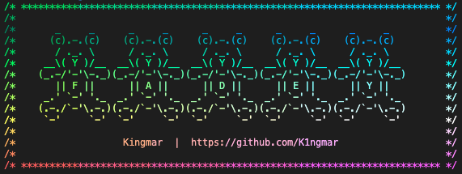

<p align="center">
  
</p>

# 🌈 <span style="color:#fc4e03">F</span><span style="color:#fcba03">a</span><span style="color:#fff200">d</span><span style="color:#4ede00">e</span><span style="color:#00d5ff">y</span>
#### ✨ Your best friend when it comes to making your output beautiful ✨

## 📝 About:

<span style="color:#fc4e03">F</span><span style="color:#fcba03">a</span><span style="color:#fff200">d</span><span style="color:#4ede00">e</span><span style="color:#00d5ff">y</span>
will make your output into rainbows °˖✧◝(⁰▿⁰)◜✧˖°

# 📋 Requirements:
This project uses **ANSI 256 colors module**
```bash
# install ansi 256 color module:
$ npm install --save ansi-256-colors
```

# ⚙️ Installation:
```bash
# Clone
$ git clone https://github.com/K1ngmar/Fadey.git

# Compile:
$ make -C Fadey/
```
>By running **MAKE** in this repository it will create a *static* library called `libfadey.a`.  
>The header is located at `{install_dir}/Fadey/includes/fadey.hpp`
```text
/Fadey/
├── includes/
│   └── fadey.hpp
├── libfadey.a
├── Makefile
└── ...
```

# ✅ Features:

> ### Everything is in the namespace {namespacename}?

* ### A global named `fadey` with `std::cout` as output stream

* ### The fade will continue across calls
  ```cpp
  // example:
  for (size_t i = 0; i < 42; i++)
    fadey << "The fade continues across calls :O" << std::endl;
  ```
  > note that if you have a lot of difference in `line length` it will work best if you pass them as a *single* string

* ### A constructor with auto reset turned `off` by default and an output stream set to `std::cout` by default
  ```cpp
  // prototype:
  Fadey(bool auto_reset = false, std::ostream& stream = std::cout);
  ```

* ### Fade pattern starts at a random position by default
  > Fadey will never *set* `srand();`

* ### Fadify function, that will turn your string into a rainbow
  ```cpp
  // prototype:
  std::string fadify(std::string to_fade);

  // used like:
  std::string faded = fadey.fadify("I am about to get faded");
  ```

* ### An output stream for strings that will fadify the string and write it to stream
  ```cpp
  // prototype:
  std::ostream& operator << (Fadey&, std::string);
  
  // used like:
  fadey << "This is going to be faded :D" << std::endl;
  ```

* ### An `auto reset` feature which will reset the fade patern to its original state every time 

  * ### A function to turn auto reset `on` and/or `off`
    ```cpp
    // prototype:
    void	set_auto_reset(bool auto_reset);

    // used like:
    fadey.set_auto_reset(true);  // turn auto reset on
    fadey.set_auto_reset(false); // turn auto reset off
    ````

  * ### Toggle auto reset
    ```cpp
    // prototype:
    void  toggle_auto_reset(void);

    // used like:
    fadey.toggle_auto_reset();
    ```
    > note that if you turn auto reset `on` the fade pattern will instantly be reset to its starting state
  
* ### New seed
  ```cpp
  // prototype:
  void	new_seed();

  // used like:
  fadey.new_seed();
  ```
  > note that this will not set `srand();`


# ❗️ Performance:
> ### Currently <span style="color:#fc4e03">F</span><span style="color:#fcba03">a</span><span style="color:#fff200">d</span><span style="color:#4ede00">e</span><span style="color:#00d5ff">y</span> is very slow, I would **NOT** recommend using it if speed is important
